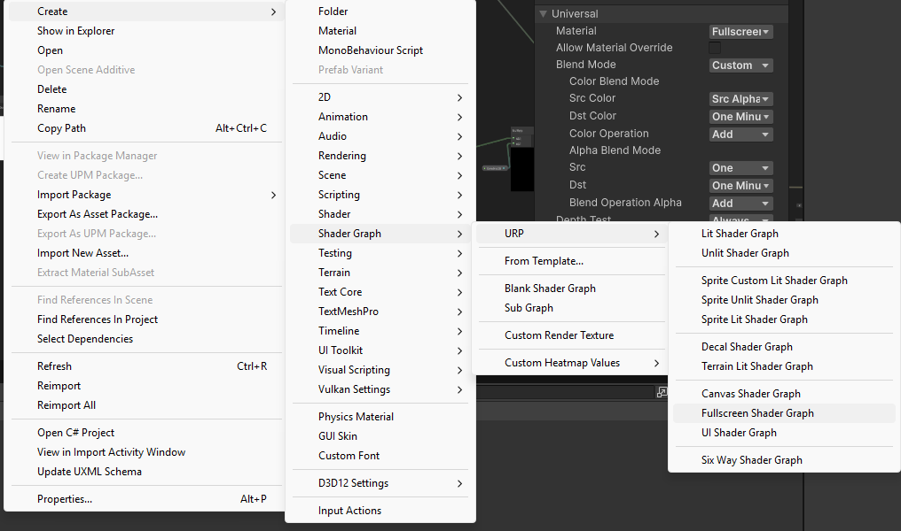
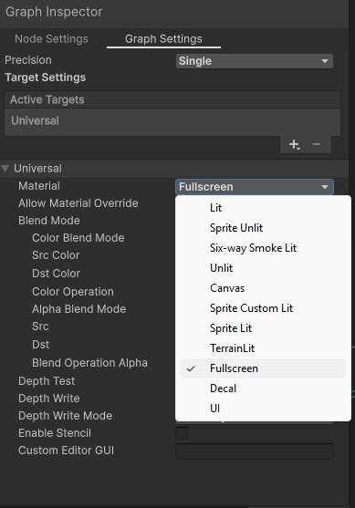
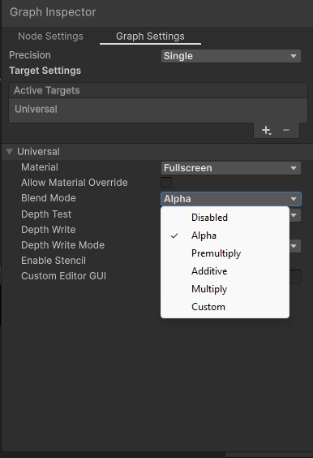
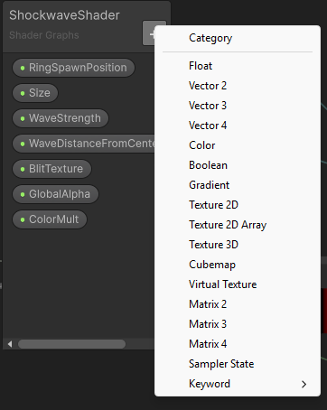
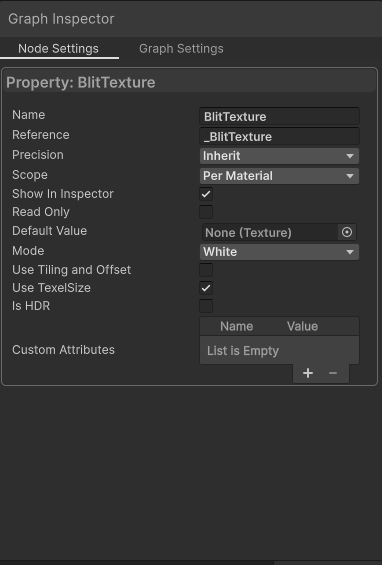

# **Using Custom Shaders and Materials**

Adding custom materials and shader effects to the render feature is fully supported.
However, when adding your own custom material to the render feature, the material's shader must be set up in a specific way. 

## Shader Format

The shader must be set up using the URP fullscreen shader format. Only URP-compatible shaders are supported.

### To create a shader graph in this format:
1. Right click the project window.
2. Create -> Shader Graph -> URP -> Fullscreen Shader Graph



### To change an existing shader graph to this format:
1. In the Graph Inspector window, under the Universal dropdown, find the Material dropdown and select Fullscreen.



## Blend Mode

All shader blend modes are supported.

However, the **Alpha** blend mode is recommended. This allows the selected layers to preserve alpha when compositing on top of the scene, meaning non-selected layers will still be visible underneath.

To change a shader graph's blend mode, go the the Graph Inspector, find the Universal dropdown under Graph Settings, and find the Blend Mode dropdown. Change this to whatever blend mode is desired.



## Reading the texture

To access the Texture2D collected by the render feature, you must sample from "_BlitTexture". Other namespaces such as "_CameraColorTexture", "_MainTex", etc. will not work.

When the material is attached to the render feature, _BlitTexture will contain camera output featuring **only** the selected layers, rendering as they normally would from the main scene camera.

To create the _BlitTexture field in Shader Graph:

1. Go to the window containing the Shader Graph's variables. Click the "+" button. Select Texture2D.



2. Select the new variable. In the Graph Inspector window, under Node Settings, set the Name to "BlitTexture" and the Reference to "_BlitTexture" exactly as shown in the image. Ensure "Show in Inspector" is checked.



3. To use the texture in your shader, connect a BlitTexture node to the Texture(T2) field on a Texture2D node.

## For HLSL shaders:

- The shader should ideally render as a fullscreen pass. Other rendering methods may cause unintended behaviour.
- The shader must sample from _BlitTexture. Sampling from other sources like _CameraColorTexture or _MainTex will not work.
- The shader should output directly to the render target.
- Using blend mode "Blend SrcAlpha OneMinusSrcAlpha" is recommended. Other blend modes are supported but may cause unintended effects.

This is a minimal HLSL shader setup designed to be work with the render feature. This shader simply reads and outputs the texture with no changes. 

```HLSL
Shader "Example/ExampleHLSLShader"
{
    SubShader
    {
        Tags { "RenderPipeline"="UniversalPipeline" }

        Pass
        {
            Name "ExampleHLSLShader"

            //Set blend mode to Alpha. This allows non-selected layers to still show beneath the render feature's selected layers.
            //Other blend modes may cause unintended side effects.
            Blend SrcAlpha OneMinusSrcAlpha

            //These settings ensure that the shader behaves as a fullscreen effect rather than a per-object material.
            Cull Off
            ZWrite Off
            ZTest Always

            HLSLPROGRAM

            #pragma target 4.5
            #pragma vertex Vert
            #pragma fragment Frag

            #include "Packages/com.unity.render-pipelines.universal/ShaderLibrary/Core.hlsl"

            //Used to generate a fullscreen triangle without a mesh. 
            struct Attributes
            {
                uint vertexID : SV_VertexID;
            };

            //Passes screen position and UV coordinates to the fragment shader.
            struct Varyings
            {
                float4 positionCS : SV_POSITION;
                float2 uv : TEXCOORD0;
            };

            //The sampled texture must use the _BlitTexture namespace to read information from the render feature.
            TEXTURE2D(_BlitTexture);
            SAMPLER(sampler_BlitTexture);

            //Generates a fullscreen triangle procedurally using SV_VertexID. 
            //Each vertex index is converted into screen-space coordinates and UVs, allowing the shader to render a full-screen effect.
            Varyings Vert(Attributes input)
            {
                Varyings output;

                output.uv = float2(
                    (input.vertexID << 1) & 2,
                    input.vertexID & 2
                );

                output.positionCS = float4(
                    output.uv * 2.0 - 1.0,
                    0.0,
                    1.0
                );

                return output;
            }


            half4 Frag(Varyings input) : SV_Target
            {
                //Flip Y UV coordinates to ensure the final effect is rendered right-side up.
                float2 uv = input.uv;
                uv.y = 1.0 - uv.y;

                //Output the final effect.
                return SAMPLE_TEXTURE2D(
                    _BlitTexture,
                    sampler_BlitTexture,
                    uv
                );
            }

            ENDHLSL
        }
    }
}
```