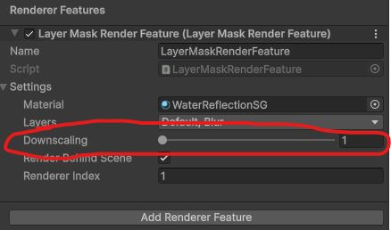

# **Performance**

Extensive performance testing has been conducted on the asset using integrated graphics.
Tests were done with shadows turned off in the render feature settings.

As the data below indicates, when rendering a large amount of sprites, the render feature may render them faster than the main camera due to stripped-down rendering settings.
Frames may take longer or shorter to render depending on the complexity of the selected material.

| Number of sprites on screen | Median frame time with sprites rendering from main scene camera (ms) | Median frame time with sprites rendering through the render feature using a simple material (ms) |
| --- | --- | --- |
| 100 | 2.089	| 2.174	|
| 200 | 2.474	| 2.554	|
| 500 | 3.19 | 2.671 |
| 1000 | 5.333 | 4.179 |
| 2000 | 9.498 | 5.742 |

## Boosting Performance

- **The #1 way to boost the performance of the render feature is by enabling Downscaling.** To change the Downscaling value, go to the render feature's settings and edit the Downscaling field. For large performance gains with minimal visual change, set Downscaling to 2x. Values larger than 2x may cause negative visual effects, though performance will improve dramatically with each downscaling increase.

- The selected material will also greatly impact performance. Optimize more intensive materials to ensure good performance. Less intensive materials will have negligible performance impact.
- Limit the amount of instances of the render feature. Multiple instances **are** supported, however the more that are running at once, the worse the performance will be.